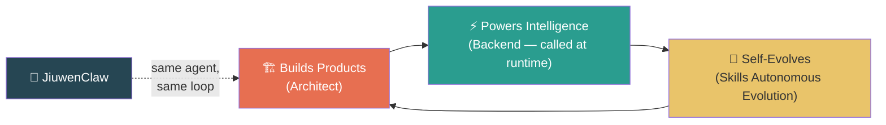
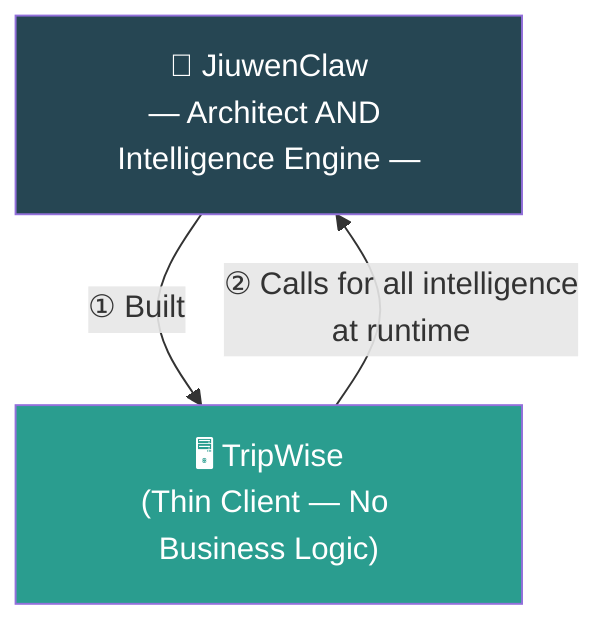
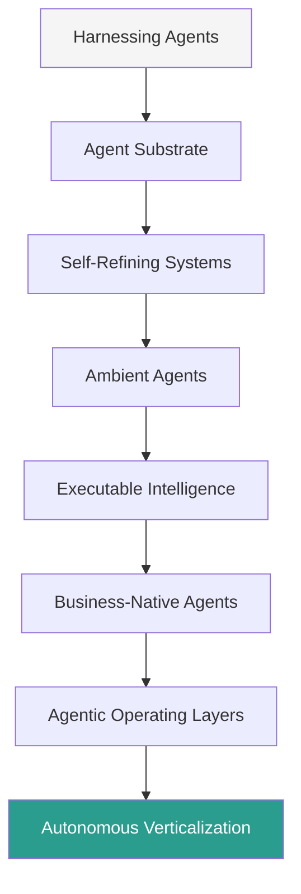
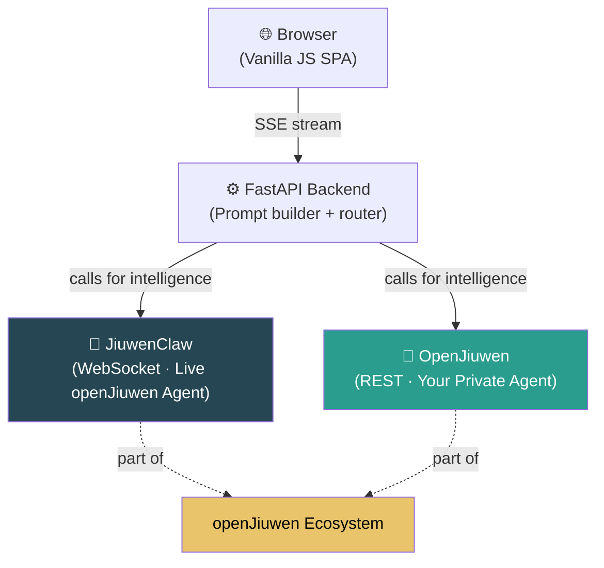
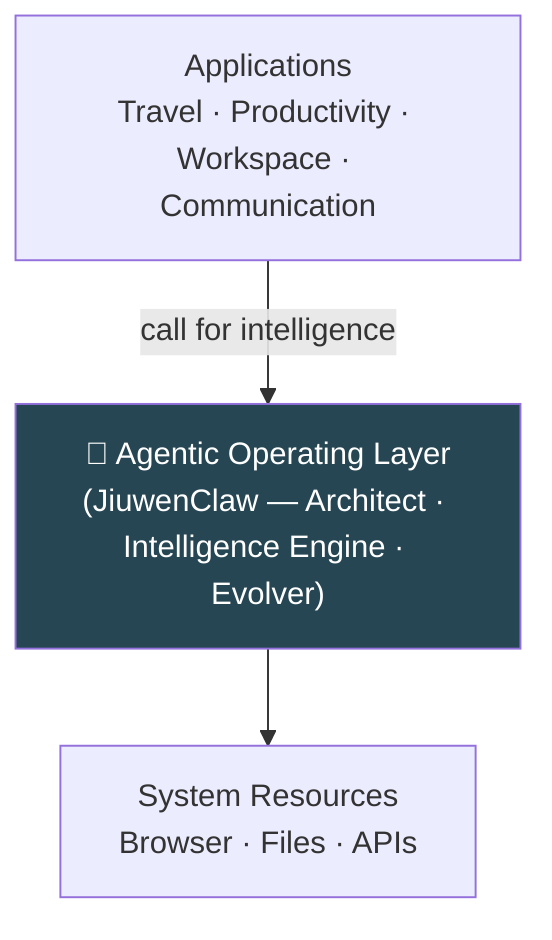
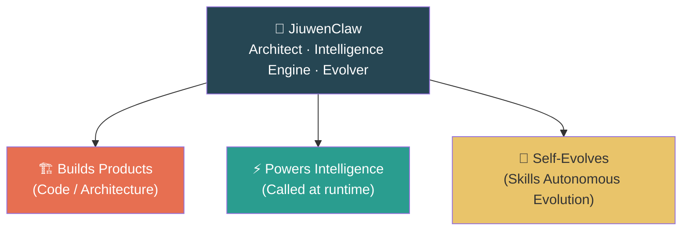

# "Intelligence Beneath Everything"
*A vision for the next generation of agent-powered systems*

---

## Opening: One Claim That Changes Everything

Before we talk about demos or architecture or use cases — let me state one thing plainly.

**JiuwenClaw is both the architect of TripWise and the intelligence TripWise calls at runtime.**

The same agent that engineered TripWise — every prompt, every schema, every workflow — is the intelligence that TripWise depends on for every user action. The product calls the agent. The agent answers. Every time.

Two roles. One agent. And the product is an empty shell without it.

That is the shift we're here to talk about today.

---

## The World We're Leaving Behind

For decades, software was built the same way.

Engineers wrote logic. Line by line. Rule by rule. Every workflow designed, every decision tree mapped, every edge case coded by hand.

The AI revolution gave us faster code generation. But the fundamental model stayed the same: humans write the logic, humans maintain it, humans update it.

**JiuwenClaw breaks that model — in two steps.**

First: it builds the product.
Then: the product calls it back for everything.

---

## TripWise: A Small Demo With a Large Message

To make this concrete, we built **TripWise** — an AI travel planner.

TripWise is simple. What powers it is not.

TripWise contains **no travel logic**. No flight search. No hotel matching. No itinerary rules. No domain knowledge at all.

Every recommendation, every decision, every plan — comes from JiuwenClaw, called by TripWise at runtime.

TripWise is just the window. **JiuwenClaw is what the window calls.**

And JiuwenClaw is also the architect that *built* the window.

TripWise is not the product. TripWise is the **proof**.

---

## The 2026 Trends — All Pointing at One Pattern

Across the industry, we track eight major agent trends for 2026. TripWise demonstrates every single one — not as a roadmap, but as something you can run today.

Each trend is an arrow pointing at the same target: **the agent as both architect and intelligence backbone of the products built on it.**

| Trend | What it means in TripWise |
|-------|--------------------------|
| **Harnessing Agents** | TripWise sends structured prompts + context to JiuwenClaw on every user action. The thin client harnesses the agent. |
| **Agent Substrate** | JiuwenClaw is not a feature. Strip it out and TripWise is an empty shell. It IS the substrate. |
| **Self-Refining Systems** | Skills Autonomous Evolution: JiuwenClaw captures its failures and improves itself without redeployment. |
| **Ambient Agents** | JiuwenClaw can operate a real browser — cookies, logins, real-world sessions — not just APIs. |
| **Executable Intelligence** | Every output is schema-validated JSON, directly parsed by TripWise into application state. |
| **Business-Native Agents** | TripWise has no business logic. JiuwenClaw IS the business logic — built by the agent, served to the thin client. |
| **Agentic Operating Layers** | Browser → FastAPI → JiuwenClaw. The agent is the intelligence layer that applications call. |
| **Autonomous Verticalization** | One architecture. The entire travel vertical. The same pattern scales to any domain. |

---

## The openJiuwen Ecosystem: Architecture and Choice

TripWise is built on the **openJiuwen ecosystem** — and the ecosystem is bigger than JiuwenClaw alone. It has two parts, offering developers a genuine architectural choice.

| | JiuwenClaw | OpenJiuwen |
|---|---|---|
| **Role** | Live hosted agent from the openJiuwen community | Platform to build and deploy your own private agent |
| **Protocol** | WebSocket — streaming responses | REST — your own logic |
| **Integration** | Identical to OpenJiuwen from TripWise's perspective | Identical to JiuwenClaw from TripWise's perspective |
| **Choose when** | You want ready-made, community intelligence immediately | You want full ownership of your intelligence layer |

The ecosystem's design principle: **both paths work the same way.** TripWise doesn't care which backend answers — it sends the same system prompt and user context, and gets the same structured JSON back. The thin client calls. The ecosystem answers.

This is the real architecture story: not "use JiuwenClaw," but **"the openJiuwen ecosystem gives you agent intelligence — your way."**

---

## The Real Unlock

### For developers
Remove the burden of building, maintaining, and debugging business logic. JiuwenClaw built the codebase and provides all intelligence on demand — change the behavior by changing the prompt.

### For product leaders
Prototype in days. Evolve without redeployment. Expand to new verticals by changing a prompt, not re-engineering a system.

### For the future
JiuwenClaw opens a new category of systems: **products that are empty shells without the agent, and full experiences with it.**

---

## The Bigger Idea: When the Agent Becomes the System

TripWise is small. The pattern is not.

If JiuwenClaw can architect and power a travel planner, it can architect and power a productivity suite.
If it can power a productivity suite, it can power a workspace.
If it can power a workspace… it can become something even more foundational.

> **Agents not inside applications — but beneath them, as both architect and intelligence engine.**

A world where experiences aren't installed — they're generated.
Where workflows aren't configured — they're inferred.
Where systems don't stagnate — they evolve.

---

## Closing: The Agent as Architect and Intelligence Engine

TripWise is just the beginning.

JiuwenClaw shows us a future where intelligent agents build the product, power the product's reasoning, and refine themselves — all inside the same continuous loop.

The same intelligence that built the product is the intelligence the product depends on.

That is the foundation of agent-built software. And it's only the beginning of what becomes possible when intelligence becomes the platform beneath everything else.
