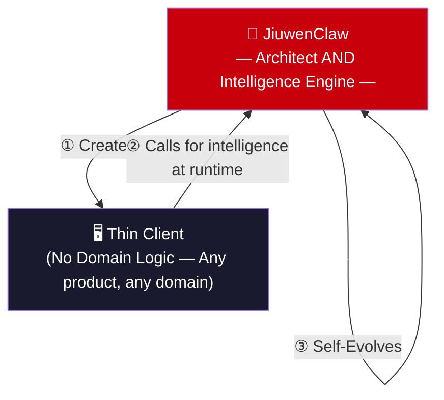
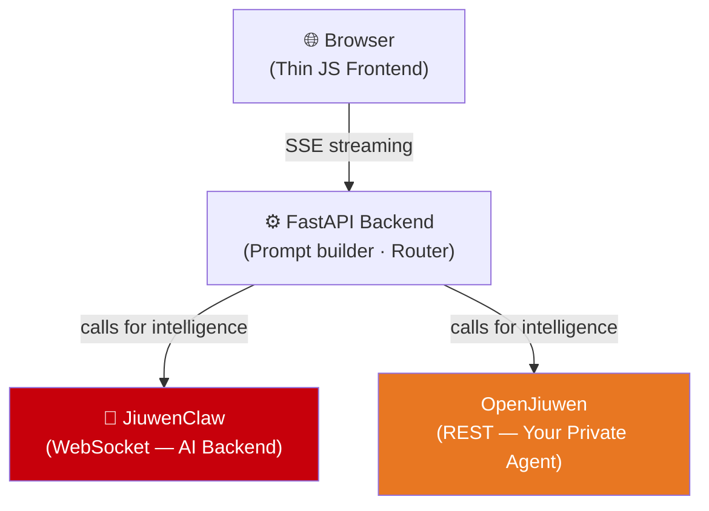
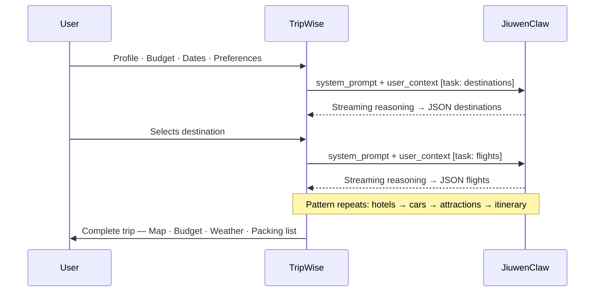
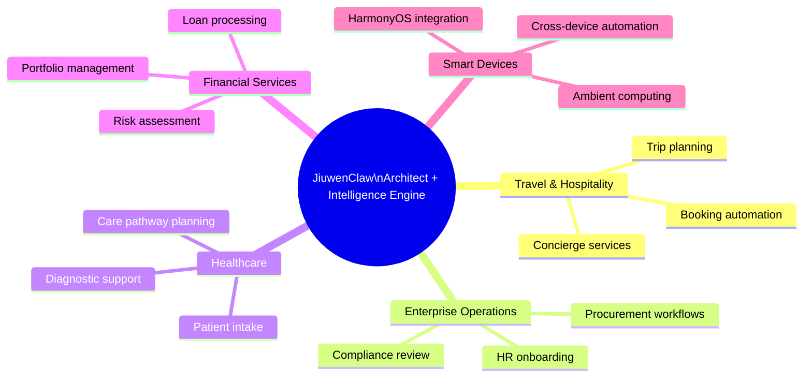
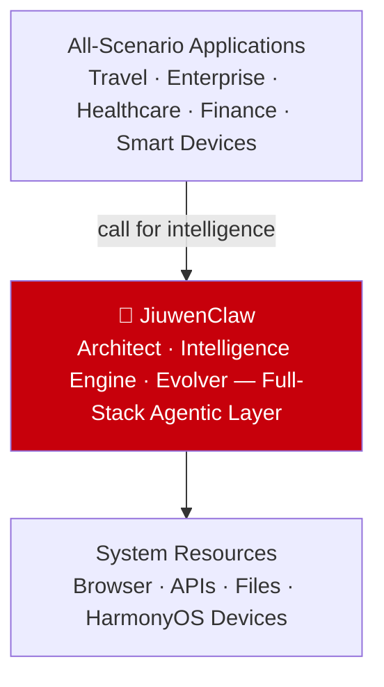

# ⭐ HUAWEI DEVELOPER CONFERENCE–STYLE KEYNOTE

---

# "Building the Intelligent Foundation for the Next Decade"

Distinguished developers, partners, and innovators — welcome.

Today, we present a single architectural principle that we believe will define intelligent systems for the decade ahead:

> **The agent that creates the thin client is also the intelligence backbone the thin client calls at runtime.**

Not a code generator paired with a separate runtime. Not an AI assistant paired with a separate system. **One agent. Two roles: architect and intelligence engine.**

JiuwenClaw builds the product. The product, with no intelligence of its own, calls JiuwenClaw for everything. And JiuwenClaw continuously evolves itself.

This is the principle behind JiuwenClaw. And it changes the architecture of everything built on top of it.

---

## A New Architecture for Intelligent Systems

Across industries, we see the same transition:

- from fixed logic → to adaptive reasoning called on demand
- from static workflows → to dynamic orchestration via agent calls
- from isolated applications → to thin clients over an intelligent layer
- from manual optimization → to continuous self-improvement

This transition is not simply a technological upgrade. It is an architectural evolution — toward systems where the same intelligence that **created** the thin client is the intelligence it **calls** at runtime.

This architecture reduces complexity, accelerates development, and enables experiences that adapt in real time — because the intelligence layer evolves continuously.

---

## JiuwenClaw: Architect AND Intelligence Engine — Full-Stack Intelligent Agent Infrastructure

We are pleased to introduce **JiuwenClaw** — the open-source agent platform from the openJiuwen community ([press release](https://www.techinasia.com/openjiuwen-community-launches-agent-jiuwenclaw-focused-selfevolution-task-management)).

JiuwenClaw is not simply an automation tool. It is a full-stack intelligence layer with four core capabilities:

| Capability | Description |
|-----------|-------------|
| **Architect** | Designs and engineers complete thin-client applications — from architecture to prompt schemas to UI |
| **Power** | Provides multi-step reasoning, tool use, and browser automation when called by the products it built |
| **Evolve** | Skills Autonomous Evolution — captures failures and self-improves continuously |
| **Integrate** | WebSocket and REST interfaces for seamless integration into any platform |

**The same agent that engineers the thin client is the intelligence the thin client calls.** This is not a feature of JiuwenClaw — it is its defining architectural property.

---

## 2026 Trend Convergence: Eight Trends, One System

The agent industry tracks eight major trends for 2026. JiuwenClaw does not address some of them. It addresses all of them — simultaneously — because they all point toward the same architectural principle: the agent as architect and intelligence backbone.

| 2026 Trend | JiuwenClaw Implementation |
|-----------|--------------------------|
| **Harnessing Agents** | Thin clients send structured prompts and accumulated context to JiuwenClaw; the agent performs all domain reasoning on demand |
| **Agent Substrate** | JiuwenClaw is not a feature inside applications — it is the substrate they call. Remove it and the application has no intelligence |
| **Self-Refining Systems** | Skills Autonomous Evolution: the agent captures failures and improves itself without human redeployment |
| **Ambient Agents** | JiuwenClaw can operate real browsers — cookies, authenticated sessions, real-world interfaces — not just APIs |
| **Executable Intelligence** | Every response is schema-validated JSON, directly parsed by the calling application into state. Structured. Reliable. Actionable. |
| **Business-Native Agents** | Applications contain no domain logic. JiuwenClaw IS the domain logic — created by the agent, provided to the thin client on demand |
| **Agentic Operating Layers** | JiuwenClaw sits at the intelligence layer that applications call — between application UI and system resources |
| **Autonomous Verticalization** | One architecture. The entire travel vertical. Replicate the pattern to any domain with zero architectural changes |

This convergence is not theoretical. It is demonstrated by TripWise — a working system built on JiuwenClaw that you can run today.

---

## Scenario Demonstration: TripWise

To demonstrate what this architecture looks like in practice, we present **TripWise** — an intelligent travel planning application built on the openJiuwen ecosystem.

**The key architectural insight:** TripWise contains zero travel domain logic. No rules. No hardcoded workflows. It is a pure thin client. All intelligence — every recommendation, every decision, every plan — comes from JiuwenClaw, called by TripWise at runtime.

And JiuwenClaw did not merely provide the runtime intelligence. **JiuwenClaw created TripWise.** The same agent that engineered every prompt, every schema, every workflow is the agent that TripWise calls when a user plans their trip.

### The openJiuwen Ecosystem: A Larger Platform

TripWise is not simply a JiuwenClaw demonstration. It is a demonstration of the **openJiuwen ecosystem** — which is larger than any single agent.

The ecosystem gives every developer and every organization a genuine architectural choice:

| Backend | Role in the Ecosystem | Protocol | Choose when |
|---------|----------------------|----------|-------------|
| **JiuwenClaw** | Live hosted agent — community-built, always available | WebSocket — streaming | You want immediate intelligence with zero setup |
| **OpenJiuwen** | Platform to build and run your own private agent | REST — your own logic | You want full ownership of intelligence and data |

**Both integrations are architecturally identical.** TripWise sends the same system prompt and user context to either backend. The response is the same structured JSON. The thin client does not differentiate.

This is the ecosystem's core design principle: **the path to intelligence is open in both directions.** Teams using the live JiuwenClaw agent and teams deploying their own private agents on OpenJiuwen follow the same integration pattern — with equal smoothness. The ecosystem scales to any organization's intelligence strategy.

This is the reference architecture for any developer or enterprise building on the openJiuwen platform.

The planning workflow shows TripWise calling JiuwenClaw at every step — each call building on all prior decisions:

---

## The Pattern Is Universal

JiuwenClaw's architect+intelligence-engine architecture is not domain-specific. Wherever a product requires intelligent reasoning, JiuwenClaw can both build the thin client and serve as the intelligence it calls.

Applications become lighter. Backends become simpler. The same agent that designed the experience is the intelligence it calls — across every device, every domain, every environment.

---

## What This Means for Developers

For developers, the architect+intelligence-engine architecture delivers:

- dramatically reduced backend complexity — no hardcoded business logic; the thin client calls JiuwenClaw instead
- faster iteration — change the prompt, change the behavior, no redeployment
- unified intelligence layer across all experiences and devices
- seamless cross-device integration, including HarmonyOS environments
- open-source foundation — full transparency, full control

It frees developers to focus on **experience**, because JiuwenClaw owns the intelligence.

---

## The Enterprise Opportunity

For enterprises, JiuwenClaw enables:

- rapid vertical digitization — entire business domains built as thin clients and powered by JiuwenClaw in weeks
- dynamic workflows that adapt automatically — change the prompt at the intelligence layer, the thin client follows
- continuous self-improvement — Skills Autonomous Evolution, no redeployment required
- lower operational overhead — one agent serves as architect AND intelligence backbone
- faster deployment across devices, platforms, and geographies

By 2030, intelligent orchestration where the agent both creates and powers thin clients will be a foundational capability of every digital enterprise. JiuwenClaw positions organizations to lead that transition today.

---

## The Ecosystem Opportunity

For the broader developer and partner ecosystem, JiuwenClaw opens a new frontier:

- intelligence that spans devices, applications, and contexts
- seamless integration with distributed operating systems including HarmonyOS
- a unified substrate for creation, reasoning, and self-improvement
- a foundation for national-scale intelligent transformation initiatives

This is not just a technical evolution. It is a strategic one — for organizations, for industries, and for the digital ecosystem as a whole.

---

## Looking Ahead

As the architect+intelligence-engine principle becomes the foundation of intelligent systems, we move toward a world where:

- thin clients are generated on demand by the same intelligence they call at runtime
- workflows adapt automatically — change the intelligence layer prompt, the product follows
- systems evolve continuously without human intervention
- intelligence becomes the platform beneath every application

This is the architecture of the next decade.

And together — developers, partners, and innovators — we will build it.

---

🌐 [openjiuwen.com/en](https://openjiuwen.com/en/) · 💻 [github.com/openJiuwen-ai](https://github.com/openJiuwen-ai) · 🧠 [gitcode.com/openJiuwen](https://gitcode.com/openJiuwen)

---

# ⭐ END OF HUAWEI KEYNOTE VERSION
