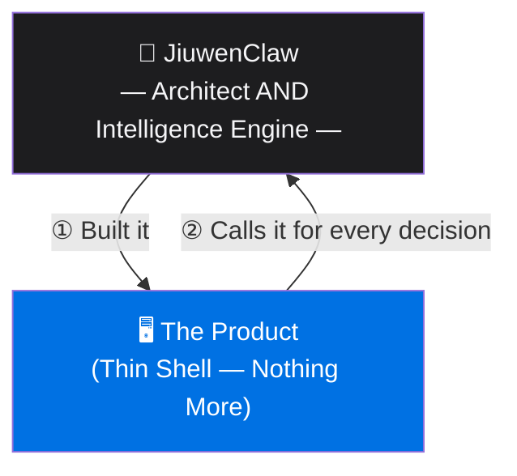
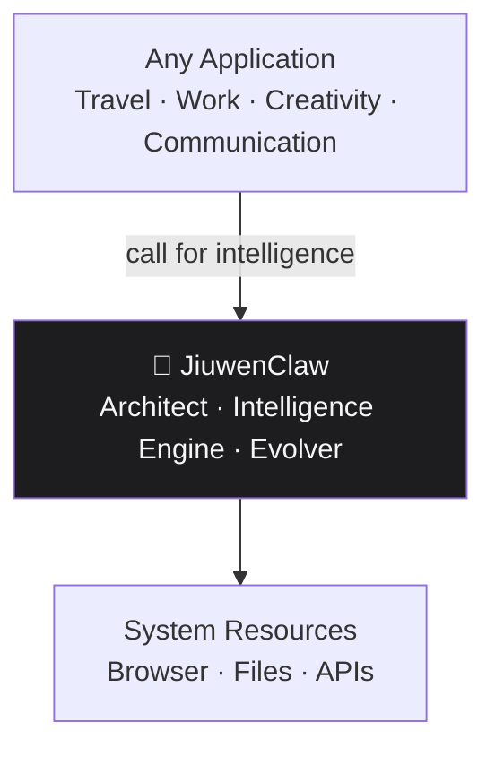
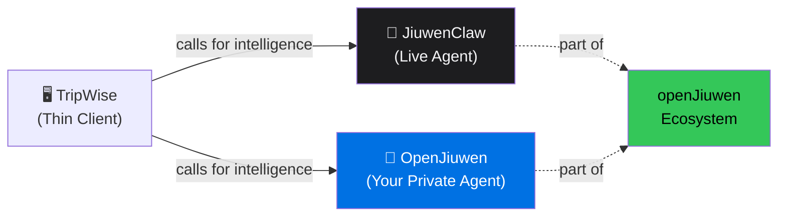
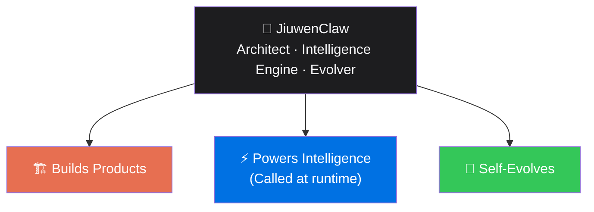

# ⭐ STEVE JOBS–STYLE KEYNOTE

---

# "There's Something in the Air… Intelligence."

---

> *[Walks to center stage. Pauses. Looks at the audience.]*

You know what I love about great technology?

It solves a problem you didn't even fully realize you had.

---

## The Old World

Let me tell you how software gets built today.

You hire engineers. They write logic. Line by line. Rule by rule. You define every workflow, every edge case, every decision tree.

And then — six months later — you ship it.

And then the world changes. And you do it all over again.

*[pause]*

The engineers write the logic.

Then a system executes the logic.

Two different things. Two different teams. Two different problems.

There's got to be a better way.

---

## A New Pattern

We're seeing a shift.

What if the intelligence that **builds** the product… is also the intelligence the product **calls** at runtime?

What if architect and intelligence engine are the same thing?

From apps with hardcoded logic —
to apps that *call an agent* for their logic.

From systems built by hand —
to systems *generated* by intelligence.

From software that stays the same —
to software that *evolves itself*.

This is not a small change.

**This is a new architecture.**

---

## Introducing JiuwenClaw

*[click — logo appears]*

We've been working on something.

Something that doesn't just assist with software development —
it **becomes the intelligence the software calls**.

We call it **JiuwenClaw**.

JiuwenClaw is an open-source agent from the openJiuwen community.

And it does something we've never seen done before in a single system.

It builds the product.

*[pause]*

And then — *the product calls it for everything it needs.*

*[pause]*

**The architect. And the intelligence engine. The same agent.**

The same agent that engineered the product is the engine the product runs on.

Isn't that incredible?

---

## Let Me Show You

*[click — TripWise appears on screen]*

We built a demo. We call it **TripWise**.

It's a travel planner.

But here's what's different.

TripWise contains **zero** travel logic.

*[pause]*

None.

No flight search algorithms. No hotel matching rules. No itinerary logic.

Nothing.

*[longer pause]*

JiuwenClaw built TripWise.

And TripWise calls JiuwenClaw for every decision it makes.

TripWise is just the window.

**JiuwenClaw is the engine the window calls.**

---

## Watch What Happens

You enter your trip. Budget. Dates. Who's going.

*[click]*

TripWise calls JiuwenClaw. JiuwenClaw finds your destinations.

*[click]*

TripWise calls again. JiuwenClaw finds your flights.

*[click]*

Hotels.

*[click]*

Attractions.

*[click]*

A full, day-by-day itinerary — with times, costs, a live map, and a packing list.

*[pause]*

At every step — TripWise calls JiuwenClaw. JiuwenClaw answers.

The same agent that built the flow is the agent powering it.

---

## The Pattern Scales

If JiuwenClaw can build and power one experience —
it can build and power many.

If it can reason about one domain —
it can reason across domains.

If it can power one workflow —
it can power entire environments.

> **Intelligence not inside the app.
> The app calls it.
> And it was the intelligence that built the app.**

---

## But Here's the Thing About the Ecosystem.

We've been talking about JiuwenClaw.

But JiuwenClaw is part of something bigger.

*[pause]*

The **openJiuwen ecosystem**.

And the ecosystem gives you a choice.

*[click]*

**JiuwenClaw** — the live agent. Call it right now. No setup. No training. Pure intelligence, over WebSocket, streaming back to your thin client.

*[click]*

**OpenJiuwen** — the platform. Build your own private agent. Own the intelligence. Own the data. Deploy it, and your thin client calls it exactly the same way.

*[pause]*

Same interface. Same JSON back. Same thin-client pattern.

Whoever decides to use the live agent — **JiuwenClaw is there.** Whoever decides to build their own — **OpenJiuwen makes it just as smooth.**

The ecosystem was designed so that the choice is yours. Not the architecture's.

*[pause]*

The thin client just calls. The ecosystem answers.

---

## And Now… One More Thing.

*[smiles, walks to edge of stage]*

JiuwenClaw doesn't just build products and power their intelligence.

It **evolves**.

JiuwenClaw has a capability called **Skills Autonomous Evolution**. When it encounters a failure — it captures it. Studies it. And improves itself. Automatically.

Architect. Intelligence engine. **And now — teacher of itself.**

The product gets smarter.

*Without a single line of code being written by a human.*

*[long pause]*

Think about what that means.

Not just a product that ships.

A product whose intelligence **learns**.

---

## This Is the Next Chapter

A world where:

- the agent that builds the product is the intelligence the product runs on
- experiences aren't installed — they're generated and called on demand
- workflows aren't configured — they're inferred from prompts
- systems don't stagnate — they evolve
- intelligence becomes the platform beneath everything

The architect and the intelligence engine are the same thing.

That is the new foundation for computing.

And today…

we're taking the first step.

---

> *[Music up.]*

---

🌐 [openjiuwen.com/en](https://openjiuwen.com/en) · 💻 [github.com/openJiuwen-ai](https://github.com/openJiuwen-ai)

---

# ⭐ END OF KEYNOTE
