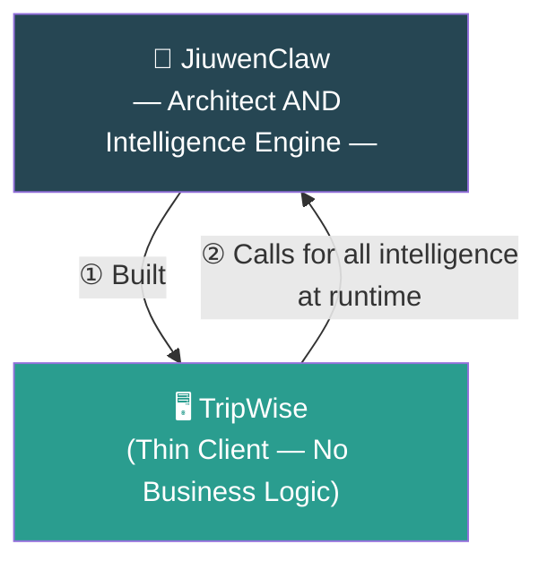
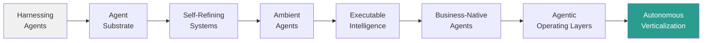
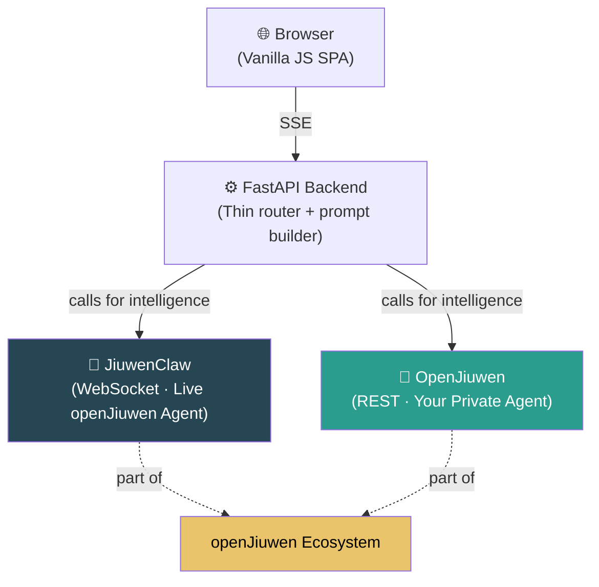
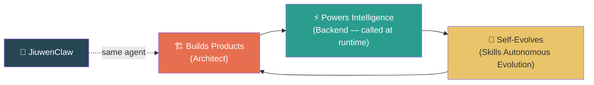

# When Intelligence Becomes the Platform: The Agent That Built Your Product Is Also the Intelligence It Runs On
**JiuwenClaw shows how the next generation of products will be architected — and powered — by agents.**

---

**One sentence:** JiuwenClaw engineered TripWise — every prompt, schema, workflow, and line of logic — and then, at runtime, TripWise calls JiuwenClaw for every decision it makes. Architect and intelligence engine. The same agent. Two roles.

---

## A New Era: Software Built by Agents, Powered by Agents

We're entering a moment where software no longer needs to be handcrafted step by step. **Intelligent agents can design it and power its reasoning continuously — from the same agent that built it.**

The open-source JiuwenClaw project — launched by the openJiuwen community ([press release](https://www.techinasia.com/openjiuwen-community-launches-agent-jiuwenclaw-focused-selfevolution-task-management)) — is one of the first real systems to make this shift tangible.

To demonstrate what this future looks like, we created **TripWise**, a travel-planning demo. But TripWise is just the example. The real breakthrough is JiuwenClaw itself.

---

## JiuwenClaw: The First Agent That Builds AND Powers the Product

Most AI tools help you write code. Most agents help you automate tasks. **JiuwenClaw does both — in the same relationship with the same product.**

It generated the entire TripWise experience — backend, frontend, workflows, prompts, schemas, UI logic — and then, without changing a line of code, **TripWise calls back to JiuwenClaw for all its intelligence at runtime**.

TripWise itself contains *no* travel logic. All intelligence lives in JiuwenClaw — and TripWise depends entirely on JiuwenClaw to provide it, on demand, with every user action.

This is the new pattern: **the agent is both the architect of the product and the intelligence backbone it calls.**

---

## TripWise: Proof of the Pattern

TripWise is small, but it demonstrates the full spectrum of 2026 agent trends — not as theory, but as a working system that runs today.

Each of these trends points to the same conclusion: the agent is not inside the product — **it is the intelligence the product calls**. JiuwenClaw already spans this entire spectrum, as both architect and runtime intelligence.

---

## The openJiuwen Ecosystem: Two Paths, One Architecture

TripWise is not just a JiuwenClaw demo. It is a demonstration of the **openJiuwen ecosystem** — and the ecosystem's most important property: **it gives you a genuine choice, with both paths equally smooth.**

The ecosystem offers two backends — not as primary and fallback, but as two equal options:

**JiuwenClaw** is the live hosted agent from the openJiuwen community. Call it via WebSocket and your thin client has immediate intelligence — no setup, no training, no deployment. The same community that built JiuwenClaw also used it to build TripWise.

**OpenJiuwen** is the platform where you build and run your own private agent. You control the intelligence. You control the data. TripWise calls your OpenJiuwen agent exactly the same way it calls JiuwenClaw — same interface, same JSON back, same thin-client pattern.

This is the openJiuwen ecosystem's architecture promise: **whoever decides to use the live agent, and whoever decides to build their own — both get the same seamless integration experience.** The thin client just calls. The intelligence just answers.

---

## The Advantage for Teams and Leaders

### For developers
- No hardcoded business logic — JiuwenClaw holds it all, and TripWise calls it
- Change behavior by changing the prompt, not the code
- No brittle workflows, no domain-specific backend complexity
- Infinite extensibility — the same thin-client pattern works for any domain

### For product leaders
- Prototype in days, not months — JiuwenClaw builds the thin client
- Built-in self-improvement via Skills Autonomous Evolution
- Browser-level automation — real-world execution, not just API calls
- The same JiuwenClaw that built the product is the intelligence it depends on — one relationship, two roles

### For the future of software
This is not "AI inside the product." This is **AI as the architect and the intelligence backbone beneath the product**.

---

## What Comes Next

When the agent that built the product is also the intelligence the product calls — something new becomes possible.

Not just faster software. Different software.

Imagine this pattern applied not to one app — but to many. Not to one workflow — but to entire domains. Not to one team — but to every team building on the openJiuwen platform.

> **Agents not inside applications — but beneath them, as both architect and intelligence engine.**

---

## Conclusion: The Agent as Architect and Intelligence Engine

TripWise is just the demonstration. JiuwenClaw is the breakthrough.

The agent that built your product is the intelligence your product runs on. That is not a coincidence. That is the architecture.

---

🌐 [openjiuwen.com/en](https://openjiuwen.com/en) · 💻 [github.com/openJiuwen-ai](https://github.com/openJiuwen-ai)

*#AI #MultiAgent #JiuwenClaw #OpenJiuwen #AgentNative #OpenSource #ExecutableIntelligence #BusinessNativeAgents*
