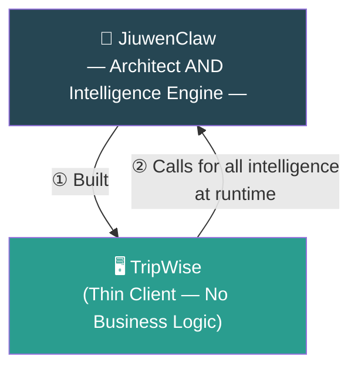
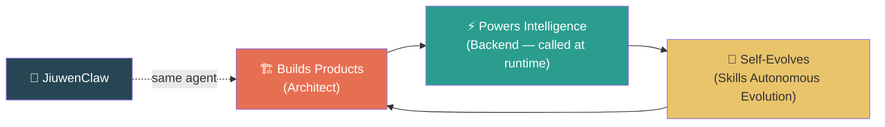
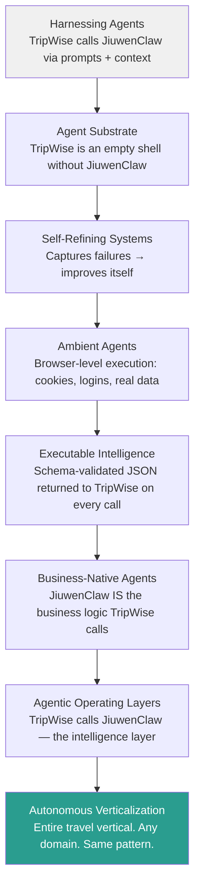
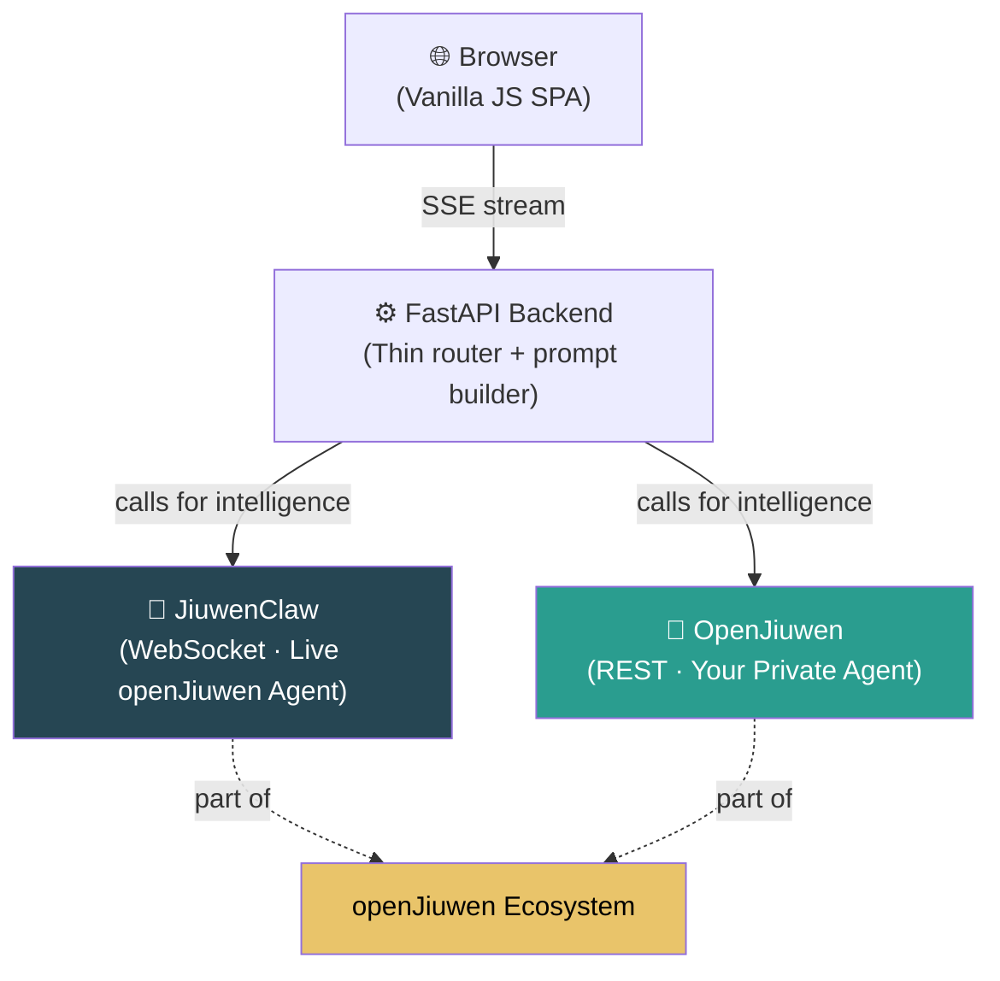
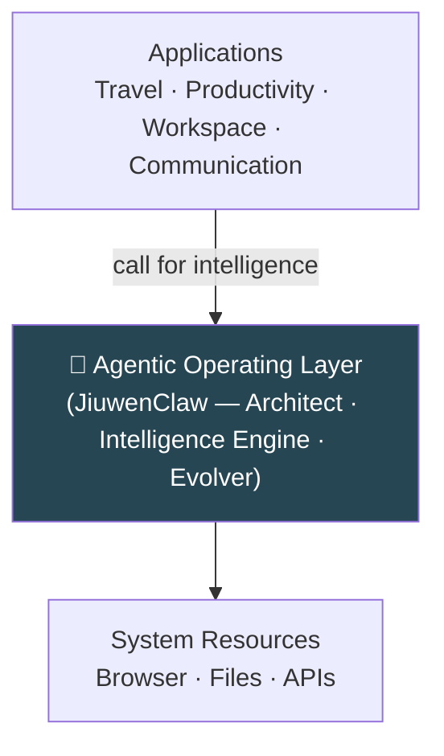
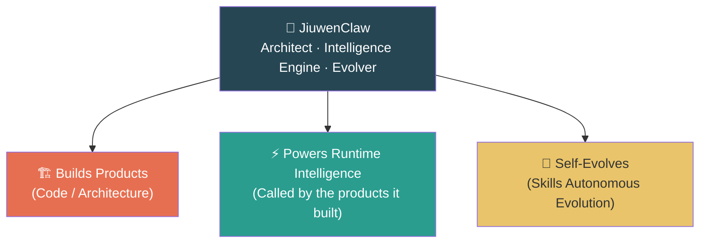

# When Agents Build the Logic… and Become the Intelligence It Runs On
**How JiuwenClaw becomes both the architect of real products and the intelligence backbone they call at runtime**

---

> **The core insight, stated plainly:**
> JiuwenClaw did not *assist* with TripWise. It *engineered* it — the backend, the frontend, the prompts, the schemas, the workflows. And then, without changing a single line of code, TripWise calls JiuwenClaw at runtime for *every* decision it makes.
>
> JiuwenClaw built TripWise. TripWise runs on JiuwenClaw's intelligence. **Architect. Intelligence engine. One agent. Two roles.**

---

## Software Is Changing From the Inside Out

In 2026, AI agents stopped being "smart chatbots" and started becoming something far more transformative: **systems that can build software and then power that software's reasoning — continuously, from the inside.**

The open-source JiuwenClaw project — introduced by the openJiuwen community ([press release](https://www.techinasia.com/openjiuwen-community-launches-agent-jiuwenclaw-focused-selfevolution-task-management)) — is one of the clearest examples of this shift.

To make it concrete, we built a small demo called **TripWise**. TripWise is not the point. TripWise is the *evidence*. The real story is what JiuwenClaw enables.

---

## Two Roles. One Agent.

Most AI tools do one thing: either generate code, or run tasks. JiuwenClaw plays two roles in the same product — and that combination is genuinely new.

### 1. JiuwenClaw created the business logic

We used JiuwenClaw to generate the entire TripWise project:

- backend, frontend, workflow
- prompts, JSON schemas, UI logic, API integrations

JiuwenClaw wasn't "assisting." It was **engineering**.

### 2. TripWise contains no travel logic

This is the pivot.

TripWise does **not** know how to pick destinations, find flights, choose hotels, or plan itineraries. It only:

- builds a system prompt
- builds a user context
- sends both to JiuwenClaw as its AI backend
- renders the JSON it receives

TripWise is a **thin client**. The business logic lives entirely in JiuwenClaw.

### 3. At runtime, TripWise calls JiuwenClaw for all intelligence

When a user runs TripWise, it is TripWise that makes the calls — sending structured prompts to JiuwenClaw and receiving structured JSON in return. JiuwenClaw is the backend being called. It performs multi-step reasoning, uses tools and memory, and returns the result.

So JiuwenClaw:
- **designed** the codebase (including every prompt and schema)
- **provides** the reasoning when TripWise calls it at runtime
- **returns** structured JSON that TripWise renders as cards
- **evolves** its own capabilities (Skills Autonomous Evolution)

Without JiuwenClaw, TripWise is an empty shell. With it, TripWise has complete intelligence for an entire travel vertical.

This is the **self-bootstrapping agent pattern**: JiuwenClaw built the thin client, and the thin client calls back to JiuwenClaw for everything it needs.

---

## TripWise as Evidence: 2026 Agent Trends, All at Once

TripWise is a small demo. But it demonstrates — in a single working system — every major agent trend defining 2026. Not as theory. As code you can run.

Each trend below describes what JiuwenClaw already does, illustrated by TripWise:

| 2026 Trend | What JiuwenClaw Does |
|-----------|---------------------|
| **Harnessing Agents** | TripWise harnesses JiuwenClaw through structured prompts + accumulated context — JiuwenClaw handles all domain reasoning on demand |
| **Agent Substrate** | JiuwenClaw is not a feature inside TripWise. Remove it and the app is an empty shell. It IS the substrate TripWise runs on |
| **Self-Refining Systems** | Skills Autonomous Evolution: JiuwenClaw captures its own failures and self-improves — no human redeployment required |
| **Ambient Agents** | JiuwenClaw can take over a real browser — cookies, sessions, logins — operating in environments built for humans |
| **Executable Intelligence** | Every JiuwenClaw output is schema-validated JSON. Not prose. Directly parsed and rendered by TripWise as application state |
| **Business-Native Agents** | TripWise has no business logic. JiuwenClaw IS the business logic — built by the agent, called by the thin client |
| **Agentic Operating Layers** | The stack: Browser UI → FastAPI → JiuwenClaw. JiuwenClaw sits at the intelligence layer, called by the application |
| **Autonomous Verticalization** | One agent covers the entire travel vertical end-to-end — the same pattern replicates to any domain |

---

## The openJiuwen Ecosystem: Bigger Than One Agent

TripWise was not just built to showcase JiuwenClaw. It was built to showcase the **openJiuwen ecosystem** — a community and platform that gives developers a genuine choice in how they integrate intelligence.

The ecosystem has two parts:

| | JiuwenClaw | OpenJiuwen |
|---|---|---|
| **What it is** | The live, hosted openJiuwen agent | The platform where you build and run your own private agent |
| **How TripWise calls it** | WebSocket — streaming intelligence | REST — your own private agent |
| **Who it's for** | Teams that want to call a ready-made, community-built live agent | Teams that want to own their intelligence layer end-to-end |
| **Integration effort** | Identical | Identical |

Both paths are equally smooth. That is the ecosystem's design principle: whoever decides to use the live agent gets JiuwenClaw's intelligence seamlessly; whoever decides to build a private agent on OpenJiuwen gets exactly the same integration experience. **The thin client doesn't know the difference. It just calls, and intelligence comes back.**

This is not a primary/fallback arrangement. It is a genuine ecosystem choice:

- **Choose JiuwenClaw** if you want the live community agent — already trained, always available, calling it is the same as calling OpenJiuwen
- **Choose OpenJiuwen** if you want to build and control your own private agent — the platform handles deployment, and TripWise calls it the same way

TripWise sends two strings to whichever backend is selected:

- **System prompt** — defines the AI's role and the exact JSON schema to return
- **User context** — everything the user has entered and selected so far

The backend reasons through the prompt and streams back JSON. TripWise renders it. That's the whole loop — and the loop works identically whether the intelligence comes from JiuwenClaw or from your own agent on OpenJiuwen.

---

## The Developer Unlock

When the agent that built your codebase is also the intelligence your codebase calls:

- no hardcoded business logic to maintain — JiuwenClaw holds it all
- no brittle workflow code to debug — change the prompt, change the behavior
- no domain expertise baked into the codebase — swap domains by swapping prompts
- infinite extensibility — the thin client pattern works for any vertical

The codebase becomes a thin, stable shell. **The agent provides everything inside it, on demand.**

---

## What Product Leaders Get

Because JiuwenClaw both created TripWise and serves as its intelligence backend, products built on this pattern can:

- be prototyped in days, not months
- be extended to new verticals without engineering sprints
- self-improve via Skills Autonomous Evolution — no redeployment
- operate at browser level — real-world automation, not just API calls

It's not "AI inside the product." It's **AI as the product's entire reasoning foundation** — built in, and called on demand.

---

## What Happens When the Agent Becomes the System?

TripWise shows what happens when one agent builds the thin client and then powers all its intelligence. A small example — but the pattern scales.

If JiuwenClaw can power a travel planner, it can power a productivity suite.
If a productivity suite, a workspace.
If a workspace, something even more foundational.

> **The agent is not just inside the operating system — the agent *is* the intelligence layer applications call.**

A substrate where applications are not "installed," but **generated by the agent, and perpetually dependent on the agent for their reasoning**.

---

## Conclusion: The Same Intelligence That Built It Powers It

TripWise is not the destination. It's the demonstration.

The real story is JiuwenClaw — an agent that can build a product, power the product's entire reasoning layer, and evolve its own capabilities, all inside the same loop.

> **The architect and the intelligence engine are the same agent. That is what JiuwenClaw is.**

And TripWise is just the first proof of what becomes possible when the agent stops being a tool… and starts becoming the intelligence layer beneath everything else.
