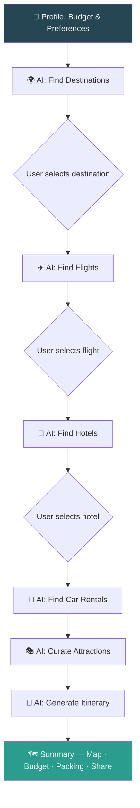
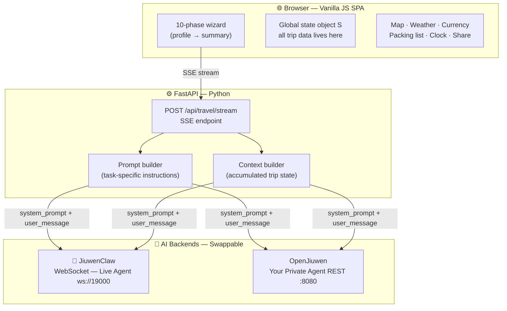
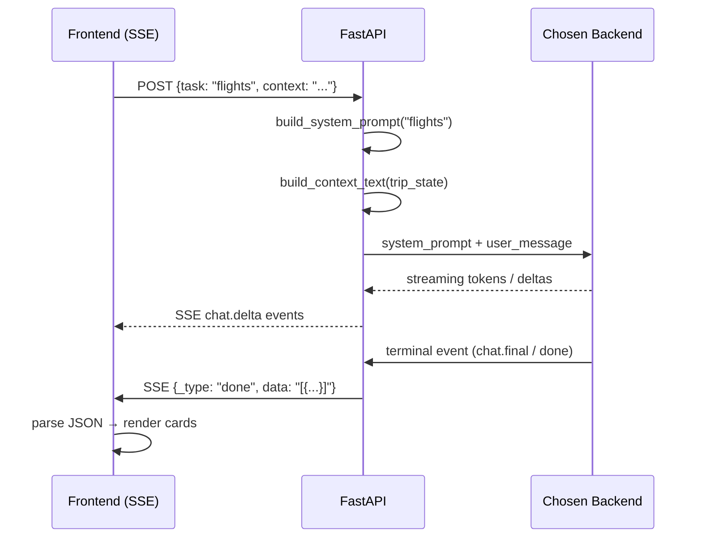

# I Stopped Building Chatbots. I Started Orchestrating Agents. Here's What Changed.

Every developer hits this wall eventually.

You've built a chatbot. It answers questions. Users say "cool." And then… nothing. Because answering questions isn't the same as getting things **done**.

That wall is what pushed me to build **Tripwise** — a fully working travel planner where a system of AI agents handles every step of the journey, start to finish, without the user ever leaving a single screen.

This post is about what I built, how it works, and the architectural shift that made it possible.

---

## The Problem: Tab Hell Is Real

Picture this: you want to plan a 3-day trip to Rome with two kids and a €2,000 budget.

By the time you're done you've got 20+ tabs: Skyscanner, Booking.com, TripAdvisor, a Reddit thread from 2019, and three different Google Maps lists that contradict each other. Two hours in, you haven't booked anything.

The tools are not the problem. The **fragmentation** is. Every app handles one slice. Nothing handles the whole journey.

---

## The Idea: One Flow. Many Agents.

What if instead of using ten tools, you described your trip once — and a system of AI agents handled every step in sequence, each one building on the last?

That's Tripwise.

```
You → [Profile + Budget + Preferences]
        ↓
     AI finds destinations
        ↓
     AI finds flights
        ↓
     AI finds hotels
        ↓
     AI finds car rentals
        ↓
     AI curates attractions
        ↓
     AI generates a full day-by-day itinerary
        ↓
     Summary: map, budget breakdown, packing list, weather, share link
```

Each step is a separate AI call with its own focused system prompt. The outputs of earlier steps become the input context for later ones. This is the chain that makes it feel coherent rather than random.



---

## The Architecture

Tripwise has two layers: a vanilla JS frontend and a Python FastAPI backend. No heavy framework anywhere.



### The Key Design Decision: Two-Part Prompts

Every single AI call — destinations, flights, hotels, all of them — sends exactly the same two-part message:

**1. System prompt** — defines the AI's role and the exact JSON schema it must return:
```
You are a flight search expert. Suggest 3 realistic options to the selected destination.
Use web search for current routes and pricing. Return ONLY a JSON array.
Each: { "airline", "route", "departTime", "price", "stops", ... }
```

**2. User message** — the accumulated trip state, formatted as plain text:
```
Traveler Profile: 2 adults, 1 child (age 8). Departing from: Tel Aviv.
Budget: 3000 USD. Dates: 2026-07-10 to 2026-07-15. Flexibility: ±3 days.
Preferences: Culture, Food. Style: Mid-range comfort.
Selected Destination: Rome, Italy.
```

The AI has all it needs. It returns a clean JSON array. The frontend parses it and renders cards. That's the entire loop.

### Two Interchangeable AI Backends

Tripwise routes every task to one of two backends from the openJiuwen ecosystem, switchable from the UI with a single dropdown:



| Backend | What it is | Protocol |
|---------|-----------|----------|
| **JiuwenClaw** | The live hosted agent from openJiuwen — connect and go | WebSocket `chat.delta` → `chat.final` |
| **OpenJiuwen** | Build and run your own private agent on the platform | HTTP POST |

The backend doesn't care which is answering. Same prompt in, same JSON schema out. Swap at will.

---

## The Real Shift

Chatbots ask questions. Agent systems make decisions.

The mental model flip is simple: instead of asking the AI "what should I do about X?" you tell it "do X, and return the result in this exact format so the next step can use it."

That shift — from *question → answer* to *task → structured output → next task* — is what makes the difference between a demo and something actually useful.

Tripwise is a travel app. But the same architecture works for:
- Legal workflows (research → draft → review → sign)
- Medical intake (symptoms → triage → appointment → instructions)
- Financial planning (goals → portfolio → rebalance → report)

The domain changes. The pattern doesn't.

---

## Try It / Build With It

Tripwise is a demo built on **OpenJiuwen**, an open-source platform for building production-grade multi-agent systems.

**OpenJiuwen** handles the hard parts: multi-agent orchestration, event-driven execution, streaming, and state management — so you can focus on the logic that matters to your domain.

🌐 [openjiuwen.com/en](https://openjiuwen.com/en/)
💻 [github.com/openJiuwen-ai](https://github.com/openJiuwen-ai)

Try the live demo → **[Tripwise](#)**

---

*What would you orchestrate? Drop it in the comments.*
