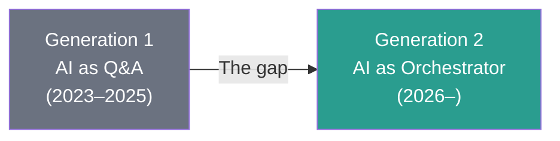
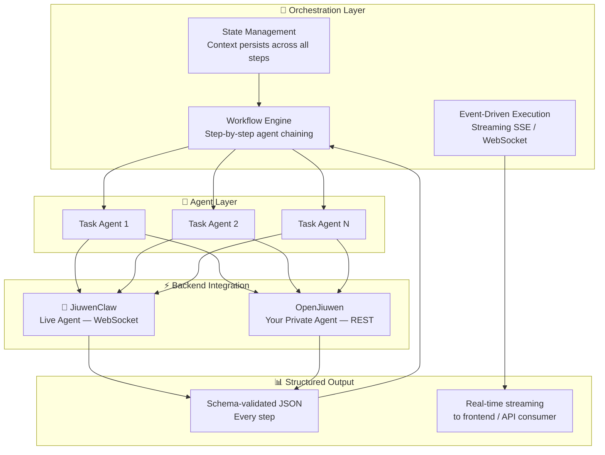
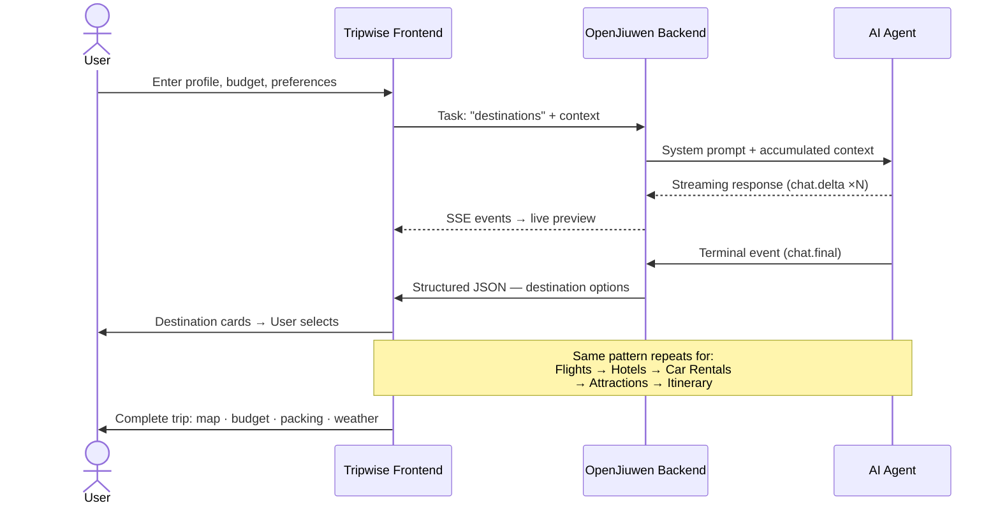
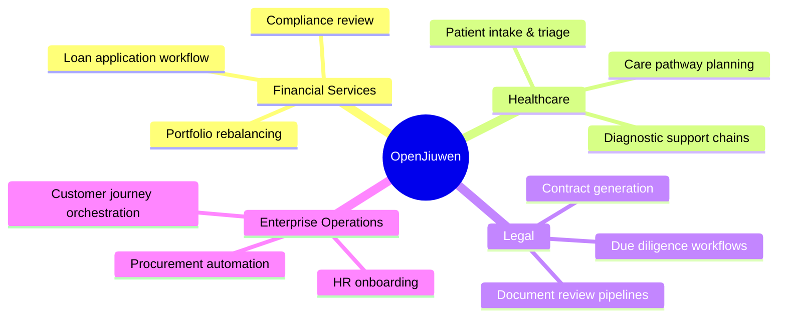

# Intelligent Orchestration: From Conversation to Action
## OpenJiuwen Platform Keynote — Conference Presentation

---

> **Presenter introduction slide**
> OpenJiuwen Platform Division

---

## Part I — The Inflection Point

We stand at a pivotal moment in the history of artificial intelligence.

For three years, the world has been captivated by large language models. Billions of conversations. Trillions of tokens. And yet — we must ask ourselves honestly: **how much has actually changed in how organizations operate?**

The answer is: not enough.

The fundamental gap is not intelligence. The intelligence is there.

The gap is **orchestration**.

Today, most AI deployments remain point solutions — a chatbot here, a summarization tool there. Each one operates in isolation. Each one answers a question. None of them complete a workflow.

**The next stage of AI transformation is not about better answers. It is about end-to-end execution.**

---

## Part II — The Market Reality

The numbers make this clear:

- The global AI agent market is projected to reach **$47 billion by 2030** — growing at 43% CAGR
- Over **72% of enterprise AI projects** fail to move beyond proof of concept — the primary reason: inability to connect AI outputs to downstream workflows
- Organizations that implement end-to-end AI orchestration report **3.2× faster task completion** and **61% reduction in manual handoffs**

These are not incremental improvements. This is a structural shift in how AI creates value.



The organizations that capture this shift will define the competitive landscape for the decade ahead.

---

## Part III — Introducing OpenJiuwen

**OpenJiuwen** is an open-source platform for building production-grade multi-agent AI systems.

It is designed around a single conviction: **AI is most powerful when agents work together in structured, verifiable workflows — not in isolation.**

### Platform Capabilities — Full-Stack Intelligent Architecture



Key architectural principles:

| Principle | Implementation |
|-----------|---------------|
| **Backend agnostic** | Same workflow runs on JiuwenClaw (live agent) or your own OpenJiuwen-hosted agent |
| **Schema-first outputs** | Every agent is instructed to return validated JSON — enabling reliable chaining |
| **Accumulated context** | Each step receives all prior decisions as structured input |
| **Streaming by default** | Real-time SSE delivery to any consumer |
| **Open source** | Apache-licensed, deployable on any infrastructure |

---

## Part IV — Scenario Demonstration: Intelligent Travel Planning

To demonstrate what full-stack orchestration looks like in practice, we present **Tripwise** — an intelligent travel planning application built entirely on OpenJiuwen.

### The Challenge

Travel planning is a prototypical multi-step decision workflow. Each decision — destination, transport, accommodation, activities — depends on all prior decisions. It requires real-time data. It must respect hard constraints (budget, dates, party size). And it must synthesize outputs across six or more distinct information domains.

This is precisely the kind of workflow where isolated AI tools fail, and where orchestrated agents succeed.

### The Workflow Architecture



### The Prompt Architecture

OpenJiuwen's orchestration is built on a two-part message structure that remains consistent across all AI backends:

**System Prompt** (task instruction + output schema):
```
You are a flight search expert. Suggest 3 options to the destination.
Use web search for current routes and pricing.
Return ONLY a JSON array: [{ "airline", "route", "price", "stops", ... }]
```

**User Message** (accumulated trip context):
```
Traveler Profile: 2 adults, 1 child. Origin: Shanghai. Budget: $3,000 USD.
Dates: 2026-07-10 – 2026-07-15. Preferences: Culture, Food.
Selected Destination: Kyoto, Japan.
```

This architecture enables **complete backend portability**: the same workflow executes identically on JiuwenClaw or your own OpenJiuwen-hosted agent with zero code changes.

### Results

The Tripwise demonstration delivers, within a single browser session:

- AI-ranked destination recommendations with match, budget, and weather scores
- Live flight options with real-time pricing via web search
- Hotel options matched to neighborhood preference and budget
- Curated attractions with cost, duration, and tips
- A complete day-by-day itinerary with GPS coordinates for every activity
- Interactive map, budget donut chart, 14-day weather forecast, live currency conversion
- Share URL, print-with-map, WhatsApp/email export, voice readout

**Total planning time: under 5 minutes. Previously: 2–4 hours.**

---

## Part V — Platform Extensibility

Travel planning is one scenario. OpenJiuwen's architecture is domain-agnostic.



Any workflow where:
- Multiple sequential decisions must be made
- Each decision informs the next
- Outputs must be structured and reliable
- Speed and consistency are critical

…is a candidate for OpenJiuwen orchestration.

---

## Part VI — The Ecosystem

OpenJiuwen is built for an open ecosystem.

We believe AI transformation is not a zero-sum competition. The industry advances faster when platforms are open, when models are interoperable, and when developers can build on shared foundations.

This is our commitment:

- **Open source first** — full codebase available, MIT/Apache licensed
- **Backend-agnostic** — works with any LLM or agent framework
- **Developer-friendly** — clear APIs, full documentation, active community
- **Production-ready** — state management, error handling, streaming, observability built in

We invite AI researchers, enterprise architects, independent developers, and platform partners to build on OpenJiuwen — and to build OpenJiuwen together.

---

## Conclusion — The Intelligent Enterprise Starts Here

The question is no longer whether AI can be intelligent.

The question is whether AI can be **useful** — systematically, reliably, at scale.

The answer requires orchestration. It requires agents that hand off to other agents. It requires outputs that feed into decisions that feed into actions.

**OpenJiuwen is that foundation.**

Tripwise shows one version of what becomes possible. The next version is yours to build.

---

🌐 [openjiuwen.com/en](https://openjiuwen.com/en/)
💻 [github.com/openJiuwen-ai](https://github.com/openJiuwen-ai)
🧠 [gitcode.com/openJiuwen](https://gitcode.com/openJiuwen)

**Try the Tripwise demo → [Live link](#)**

---

*Thank you.*

---
*OpenJiuwen Platform Division | Huawei Connect 2026*
