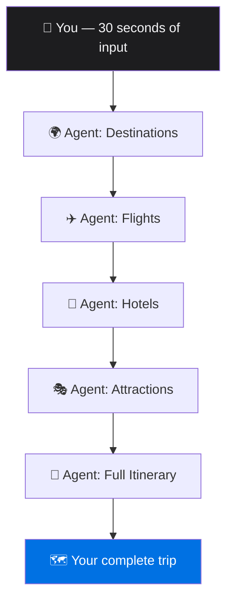

# Tripwise — Keynote Script
## *Steve Jobs Style*

---

> *[Dim lights. Single spotlight. Walk to center stage.]*

---

### Slide: Blank. Just you.

I love to travel.

Paris. Tokyo. Buenos Aires. There's nothing like arriving somewhere completely new and feeling that first rush of a city you've never seen.

But I **hate** planning trips.

---

### Slide: "20 tabs."

Twenty tabs open.

Flights here. Hotels there. "Top 10 things to do in Rome" — seventeen different versions, all contradicting each other.

Three hours later, I haven't booked anything. I'm exhausted before the trip has even started.

*[pause]*

There's got to be a better way.

---

### Slide: "What if your computer just… did it?"

What if you described your trip once — who's going, how much you want to spend, what you love — and an AI system just… handled everything?

Not answered your questions. Not given you links.

Actually. Made. Decisions.

*[pause for effect]*

Today, we're introducing **Tripwise**.

---

### Slide: Tripwise logo. Clean. Nothing else.

*[beat]*

Tripwise is a multi-agent AI travel planner.

You tell it what you want. It plans the entire trip.

---

### Slide: "Step 1. Tell it who you are."

You fill in three screens. Thirty seconds.

Who's traveling. Your budget. The dates. What you love — art, food, adventure, history.

That's it.

*[click]*

---

### Slide: "Step 2. Watch it work."

Here's where it gets interesting.

The moment you hit "Find Destinations" — an AI agent goes to work. It searches. It reasons. It comes back with destinations that actually match *your* profile, *your* budget, *your* travel style.

Not a generic list. **Your** list.

*[click]*

You pick a destination.

*[click]*

Now a second agent finds flights. Real airlines. Real routes. Real prices.

*[click]*

A third agent finds hotels.

*[click]*

A fourth finds things to do.

*[click]*

And then — a final agent takes everything you've selected and writes a complete day-by-day itinerary. With times. Costs. A map. Every detail.

*[pause]*

Each agent knows what the previous one decided. Each step makes the next one smarter.

*[beat]*

Isn't that beautiful?

---

### Slide: The summary screen. Full bleed screenshot.

This is the summary screen.

Your map. Your budget breakdown. The weather at your destination. The local currency rate. A packing list built from your actual itinerary. A live clock showing the time where you're going right now.

One screen. Your entire trip. Done.

---

### Slide: "But there's something else."

Now. I want to show you something that we think is really important.

Under the hood, Tripwise connects to **two AI backends from the openJiuwen ecosystem**. And you can switch between them — live, in real time, from a single dropdown.

---

### Slide: Two logos. JiuwenClaw. OpenJiuwen.

**JiuwenClaw** — The live openJiuwen agent. Multi-step reasoning, tool use, memory — running on your own infrastructure. Connect and go.

**OpenJiuwen** — The platform where *you* build and run your own private agent. Your model. Your tools. Your logic. Tripwise just talks to it.

*[pause]*

Same trip. Same results. **Your** agent driving it.

*[pause]*

This is not a locked-in system. This is an **open** system.

---

### Slide: "One more thing."

*[smiles]*

One more thing.

Travel is just the beginning.

The same pattern — describe a goal, let a system of agents make decisions, hand off outputs from one step to the next — works for **anything**.

Loan applications. Medical intake. Legal workflows. Hiring. Procurement.

Any process where you currently open 20 tabs… is a candidate.

*[beat]*

We are entering the age of **AI orchestration**.

Not AI that answers. AI that **acts**.

---

### Slide: "OpenJiuwen. Open source. Start building."

Tripwise is built on OpenJiuwen — an open-source platform for multi-agent AI. Available today.

🌐 openjiuwen.com/en
💻 github.com/openJiuwen-ai

*[pause]*

Oh, and one more thing — it's free.

*[smiles, walks off]*

---

> *[Music up.]*

---

*#OpenJiuwen #MultiAgent #AI #TripWise*
