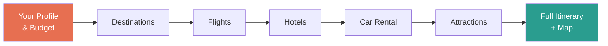

# Planning a Trip Used to Waste Half a Day. Not Anymore.

20 tabs. 3 hours. Still nothing booked.

Sound familiar?

We built **Tripwise** to fix that — and the result is something we haven't seen done quite like this before.

---

## One Screen. Zero Tab Switching. Your Entire Trip Planned by AI.

Tell Tripwise who's traveling, your budget, your dates, and what you love.

Then watch:

**🌍 Destinations** — AI finds places that actually match your style and budget, with real price estimates.

**✈️ Flights** — Real routes, real airlines, real prices. Ranked for you.

**🏨 Hotels** — Matched to your neighborhood preference, rating, and nightly budget.

**🚗 Car rental** — Found and compared. Or skip it — no pressure.

**🎭 Attractions** — Curated for your interests. Not the same 5 tourist traps everyone lists.

**📅 Full itinerary** — A complete day-by-day plan, timed and costed, with a live map.

Every step flows into the next. Pick what you like. Skip what you don't. Done in minutes.

---

## Under the Hood: Multi-Agent AI Orchestration

This isn't a chatbot with a travel plugin.

It's a system of AI agents — each one focused on exactly one task, each one passing its output to the next. Built on **OpenJiuwen**, an open-source platform for production-grade multi-agent AI.

Two AI backends. One interface. Swap between **JiuwenClaw** (the live openJiuwen agent) and **OpenJiuwen** (your own private agent, built on the platform) from a single dropdown — live, mid-planning.

---

## What You Get on the Summary Page

- 🗺️ Interactive map with every attraction pinned by day
- 💰 Budget breakdown donut chart (flights · hotel · car · activities)
- 🌤️ 14-day weather forecast for your destination
- 💱 Live currency conversion at today's rates
- 🧳 Smart packing list — including a "pack by day" tab built from your itinerary
- 🕐 Dual live clock: home timezone + destination
- 📤 Share as URL · Copy as Markdown · Send via WhatsApp or Email · Print with map

---

## The Bigger Picture

Travel is the demo. The pattern scales everywhere.

The same orchestration that plans your trip can handle a loan application, a patient intake, a legal document review, or a hiring workflow. Any multi-step process where each decision informs the next is a candidate.

AI stops being a chat window. It becomes a system that gets things done.

---

**Try Tripwise → [Live Demo](#)**

**Build your own → [OpenJiuwen on GitHub](https://github.com/openJiuwen-ai)**

🌐 [openjiuwen.com/en](https://openjiuwen.com/en) · 💻 [GitHub](https://github.com/openJiuwen-ai) · 🧠 [GitCode](https://gitcode.com/openJiuwen)

---

*#AI #MultiAgent #TravelTech #OpenJiuwen #AgentOrchestration #LLM #OpenSource*
